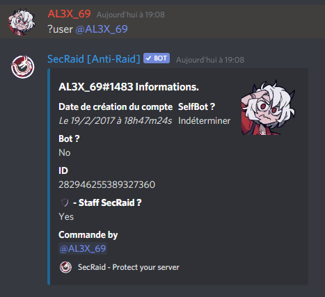

# Basiques

## ?ping



Récupérer le temps de latence du bot



```text
?ping
```



## ?support



Obtenir les liens utiles du bot, tel que le lien du serveur discord ou le lien d'ajout du bot



```text
?support
```



## ?invite




Cette commande est prévue pour une prochaine version


Cette commande est un alias de la commande ?support


Voir aussi: ?support




```text
?invite
```



## ?help



Envoie la page d'aide du bot \(liste des commandes\) dans vos messages-privés



```text
?help
```



## ?user



Récupérer les informations d'un utilisateur



```markup
?user <@user>
```







